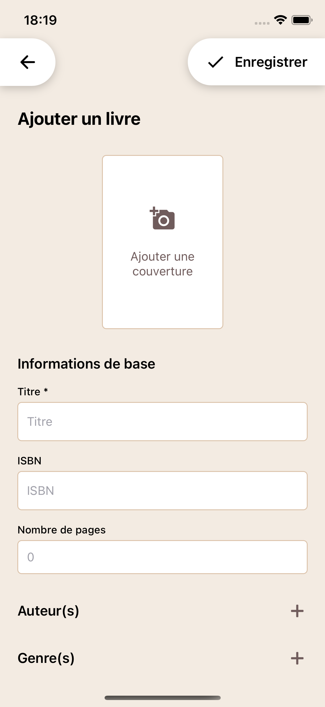

# Yomi

Yomi est une application mobile de gestion de lectures développée avec React Native et Expo dans le cadre d’un projet informatique individuel (ENSC - S9).

L’application permet de constituer une bibliothèque personnelle de livres, suivre leur état de lecture et accéder rapidement aux informations associées à chaque ouvrage.

---

# Sommaire

- [Aperçu de l'application](#aperçu-de-lapplication)
- [Documentation](#documentation)
- [Fonctionnalités](#fonctionnalités)
- [Technologies utilisées](#technologies-utilisées)
- [Installation du projet](#installation-du-projet)
  - [Tester l'application sur iPhone (via Xcode)](#tester-lapplication-sur-iphone-via-xcode)
  - [Générer un fichier d'installation Android (APK)](#générer-un-fichier-dinstallation-android-apk)
- [Structure du projet](#structure-du-projet)
- [Gestion des versions](#gestion-des-versions)
- [Auteur](#auteur)

---

# Aperçu de l'application




---

# Documentation

- [Maquettes]()
- [Spécification fonctionnelle]()
- [Planning]()

---

# Fonctionnalités

### Gestion de la bibliothèque

- visualiser l’ensemble des livres enregistrés
- affichage sous forme de cartes avec couverture
- statistiques rapides (nombre total, livres lus, à lire)

### Fiche détaillée d’un livre

- affichage des informations complètes
- modification des informations
- suppression d’un livre
- modification rapide de l’état de lecture

### Ajout de livre

- formulaire d’ajout d’un nouveau livre
- choix d’une couverture
- stockage dans la base de données locale

### Suivi de lecture

- gestion de l’état de lecture (à lire, en cours, lu)

### Feedback utilisateur

- affichage de notifications (toast) après :
  - ajout
  - modification
  - suppression

---

# Technologies utilisées

### React Native

Framework utilisé pour développer l'application. Il permet de créer une application compatible iOS et Android à partir d’un même code source.

### Expo

Outil facilitant le développement React Native. Expo simplifie la configuration du projet, la gestion des dépendances et l'accès à certaines fonctionnalités natives du téléphone.

### TypeScript

Langage typé (surcouche de Javascript) permettant de réduire les erreurs et de rendre le code plus maintenable.

### SQLite

Base de données locale utilisée pour stocker les livres de la bibliothèque directement sur le téléphone. Cela permet à l’application de fonctionner sans connexion internet.

### React Navigation

Bibliothèque utilisée pour gérer la navigation entre les différents écrans de l’application.

### Prettier

Outil de formatage automatique du code utilisé pour garantir une mise en forme cohérente dans tout le projet.

---

# Installation du projet

> Prérequis

Avant de lancer le projet, assurez-vous d'avoir installé :

- Node.js
- npm ou yarn
- [Android Studio](https://docs.expo.dev/get-started/set-up-your-environment/?mode=expo-go&platform=android&device=simulated) (pour simulateur Android)
- [Xcode](https://docs.expo.dev/get-started/set-up-your-environment/?mode=expo-go&platform=ios&device=simulated) (pour simulateur iOS - macOS uniquement)

_Remarque : Sur macOS et Linux, il est possible d'utiliser [Homebrew](https://brew.sh/) pour installer facilement certaines dépendances comme Node.js ou Android Studio._

> Cloner le projet

```sh
git clone https://github.com/lammarboudjelal/yomi.git
cd yomi
```

> Installer les dépendances

```sh
npm install
```

> Générer les fichiers natifs (Expo Prebuild)

Le projet utilise certaines bibliothèques nécessitant des modules natifs, comme par exemple l'extraction de couleurs d'une image ([react-native-image-colors](https://www.npmjs.com/package/react-native-image-colors)). Dans ce cas, Expo doit générer les projets iOS et Android natifs.

```sh
npx expo prebuild
```

Cette commande génère les dossiers ios/ et android/ nécessaires au fonctionnement des modules natifs.

> Lancer l'application

**iOS**

```sh
npx expo run:ios
```

Cette commande compile l'application et la lance sur le simulateur iOS par défaut.

**Android**

```sh
npx expo run:android
```

Cette commande compile l'application et la lance sur le simulateur Android.

## Tester l'application sur iPhone (via Xcode)

Première connexion au téléphone : 
1. Ouvrir le projet /ios dans Xcode (depuis un terminal positionné dans le dossier /yomi): `open ios/*.xcworkspace`.
2. Dans Xcode, sélectionner un simulateur ou iPhone physique connecté à l'ordinateur via USB.
3. Cliquer sur le bouton Run.
L'application est alors compilée et installée directement sur l'iPhone.

Remarques : 
- L'application fonctionnera sur l'iPhone uniquement si le serveur est actif (commande `npx expo start` ou `npx expo run:ios`), de la même façon que le simulateur.
- L'ordinateur et le téléphone doivent être connecté au même réseau.
- Le téléphone n'a pas besoin d'être branché à l'ordinateur à chaque utilisation, mais le processus (étapes 1 à 3) devra être réitéré à chaque ajout d'un module natif au projet (modification du dossier ios suite à la commande `npx expo prebuild`).

## Générer un fichier d'installation Android (APK)

Il est possible de générer un fichier APK pour installer l’application sur un appareil Android sans passer par le Play Store.

Création du fichier d'installation : 
1. Installer Expo Application Services (EAS) : `npm install -g eas-cli`.
2. Se connecter : `eas login`.
3. Configurer le build : `eas build:configure`.
4. Lancer la génération de l’APK : `eas build -p android --profile preview`.
5. À la fin du build, un lien de téléchargement est fourni. Il permet de télécharger l'APK et d'installer directement sur un téléphone Android.

Installation sur téléphone : 
1. Copier le fichier sur le téléphone.
2. Autoriser les sources inconnues si nécessaire.
3. Ouvrir le fichier APK pour installer l’application.

---

# Structure du projet

```
src/
 ├── components
 │
 ├── screens
 │
 ├── services
 │
 ├── data
 │
 ├── navigation
 │
 ├── utils
 │
 ├── models
 |
 └── App.tsx
```

Organisation générale :

- components : composants réutilisables
- screens : écrans principaux de l'application
- services : logique métier et accès aux données
- data : gestion de la base SQLite
- navigation : configuration de React Navigation
- utils : fonctions utilitaires
- models : types et modèles de données

---

# Gestion des versions

Le projet utilise Git avec la stratégie suivante :

- main : branche stable
- dev : branche de développement

Les nouvelles fonctionnalités sont développées sur dev puis intégrées dans main lors des releases.

---

# Auteur

Lina AMMAR-BOUDJELAL\
Groupe 1 - Promotion 2027
